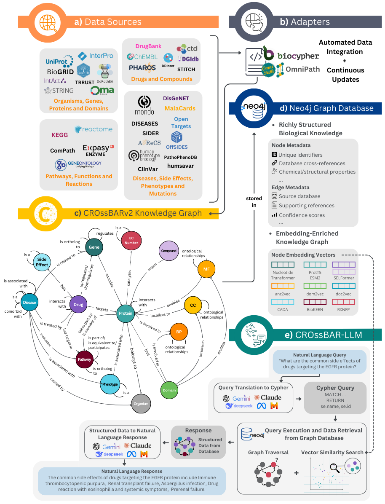

<div align="center">
  <picture>
    <!-- <source media="(prefers-color-scheme: light)" srcset="">
    <source media="(prefers-color-scheme: dark)" srcset=""> -->
    <source srcset="https://crossbarv2.hubiodatalab.com/static/images/crossbar-logo.svg">
    
  </picture>
</div>

<div align="center">
    <a href="https://crossbarv2.hubiodatalab.com"></a>
    <!-- <a href="https://biorxiv.org"></a> -->
    <!--  -->
    <!--  -->
</div>
<br>

# CROssBARv2: A Unified Biomedical Knowledge Graph for Heterogeneous Data Representation and LLM-Driven Exploration

## TL;DR

**CROssBARv2** is a comprehensive computational framework that integrates large-scale biological and biomedical data into a unified knowledge graph (KG). The framework includes:

- :arrows_counterclockwise: **Automated Data Integration**: Systematically processes and integrates data from 34 data sources, covering 14 node types and 51 edge types.
- :mag: **Vector Search**: Includes precomputed vector embeddings from biological representation learning models as node embeddings for sophisticated semantic similarity searches.
- :speech_balloon: **LLM-Powered Chat**: Integrates Large Language Models (CROssBAR-LLM) for answering scientific questions using natural language.
- :globe_with_meridians: **User-Friendly Platform**: Provides an intuitive online interface with fast queries, interactive visualizations, and an API for easy access, even for non-programmers.
- :bar_chart: **Validation & Applications**: Demonstrated utility through biomedical use-cases, literature validation, benchmarking of LLMs vs. CROssBAR-LLM for scientific Q&A, and deep learning experiments on protein function prediction.

## Abstract

Biomedical discovery is hindered by fragmented, modality-specific repositories and uneven metadata, limiting integrative analysis, accessibility, and reproducibility. We present CROssBARv2, a provenance-rich biomedical data-and-knowledge integration platform that unifies heterogeneous sources into a maintainable, queryable system. By consolidating diverse data sources into an extensive knowledge graph enriched with ontologies, metadata, and deep learning-based vector embeddings, the system eliminates the need for researchers to navigate multiple, siloed databases and enables users to uncover novel insights. CROssBARv2 provides programmatic access, interactive exploration, embedding-based semantic search, and an intuitive natural language interface powered by large language models (LLMs). We assess CROssBARv2 through (i) multiple use-case analyses to test biological coherence; (ii) knowledge-augmented biomedical question-answering benchmarks comparing CROssBAR-LLM with up-to-date generalist LLMs; and (iii) a deep-learning–based predictive-modelling validation experiment for protein-function prediction using heterogeneous CROssBARv2 data. Collectively, CROssBARv2 offers a scalable and user-friendly foundation that facilitates hypothesis generation, knowledge discovery, and translational research.

## CROssBARv2 Workflow Overview



**Figure 1. Overview of the CROssBARv2 workflow.** (a) Integration of data from 34 well-established sources covering various biomedical domains. (b) Automatic retrieval, standardisation, and integration of source data using modular adapter scripts. (c) CROssBARv2 KG schema, comprising 14 node types and 51 edge types. (d) Storage of the KG in a Neo4j graph database, along with rich metadata and node embeddings computed using deep learning-based methods. (e) Execution of the CROssBAR-LLM workflow, which translates natural language queries into Cypher, executes the queries on KG, and synthesizes structured results into natural language responses; also supports vector-based similarity search. (f) Exploration of the KG through three interfaces: natural language querying via LLM interface, programmatic access via GraphQL API, and interactive visual exploration via the Neo4j browser.

---

# The CROssBARv2 Web Platform

The easiest way to experience CROssBARv2 is through our interactive web platform. It provides multiple interfaces tailored for different use cases, from natural language chat to interactive, visual exploration. Check out our website [here](https://crossbarv2.hubiodatalab.com/).

## Chat with the CROssBARv2

Interact with the CROssBARv2 database using natural language. Through the **Graph Explorer**, you can navigate direct relationships between entities, retrieving structured facts and connections from the graph. The **Semantic Search** feature, powered by embeddings, enables the discovery of biologically meaningful patterns by identifying similarities between entities, that go beyond direct graph links.

**[Try the CROssBAR-LLM](https://crossbarv2.hubiodatalab.com/llm)**


## Programmatic Access with Apollo GraphQL API

Access the CROssBARv2 database programmatically using a flexible GraphQL interface. You can build custom, nested queries to retrieve precisely the data you need. It's ideal for integrating CROssBARv2 into your analytical workflows or applications, and supports seamless development with tools like Apollo Studio.

**[Explore the API in Apollo Studio](https://crossbarv2.hubiodatalab.com/api)**


## Manually explore with Neo4j Browser

Explore the CROssBARv2 KG visually through the Neo4j Browser interface. This interactive tool lets you run Cypher queries, visualize nodes and relationships, and investigate the structure of the graph in detail.

**[Open the Neo4j Browser](https://neo4j.crossbarv2.hubiodatalab.com/browser/?preselectAuthMethod=[NO_AUTH]&dbms=bolt://neo4j.crossbarv2.hubiodatalab.com)**


---

# Download / Usage

To clone this repository:

```bash
git clone --recurse-submodules https://github.com/HUBioDataLab/CROssBARv2
```

## CROssBARv2 KG

This repository provides adapter scripts for collecting, processing, and harmonizing biological data from a wide range of biomedical and biological sources. The adapters transform heterogeneous datasets into a standardized format that can be seamlessly imported into a Neo4j graph database.

Check the relevant [README](CROssBARv2-KG/README.md).

## CROssBARv2 Compose

This repository contains the unified docker compose file, of the services below.

Check the relevant [README](crossbar-compose/README.md).

## CROssBARv2 LLM

This repository contain frontend and backend scripts for CROssBARv2 LLM.

Check the relevant [README](CROssBAR_LLM/README.md).

## CROssBARv2 GraphQL

This repository contains the GraphQL API interface of CROssBARv2 KG, which is useful for programmatic data retrieval.

Check the relevant [README](crossbar-graphql/README.md).

## CROssBARv2 Browser

You can browse our KG with Neo4j.

## CROssBARv2 TLS Dumper

This repository contains the necessary TLS utils, to host Neo4j with Traefik.

Check the relevant [README](crossbar-tls-dumper/README.md).


# Cite

```
@article{Sen_2025_CROssBARv2,
  author    = {Bünyamin Şen and Erva Ulusoy and Melih Darcan and Mert Ergün and Sebastian Lobentanzer and Ahmet S. Rifaioglu and Dénes Türei and Julio Saez-Rodriguez and Tunca Doğan},
  title     = {CROssBARv2: A Unified Biomedical Knowledge Graph for Heterogeneous Data Representation and LLM-Driven Exploration},
  journal   = {Journal Name},
  year      = {2025},
  volume    = {XX},
  number    = {X},
  pages     = {XXX--XXX},
  doi       = {10.XXXX/journal.XXXXXXX},
  note      = {Project website available at \url{https://crossbarv2.hubiodatalab.com}}
}
```

# Licence

## Licence 📜

This project is licensed under the **GNU Affero General Public License v3.0 (AGPL-3.0)**.

The AGPL-3.0 is a strong copyleft license that ensures that derivatives of the work, including those modified and offered as a service over a network, remain free and open-source. If you use this software in a network service, you are required to make the source code of your modified version available to the users of that service.

For the full license text, please see the [LICENSE](LICENSE) file included in this repository.
